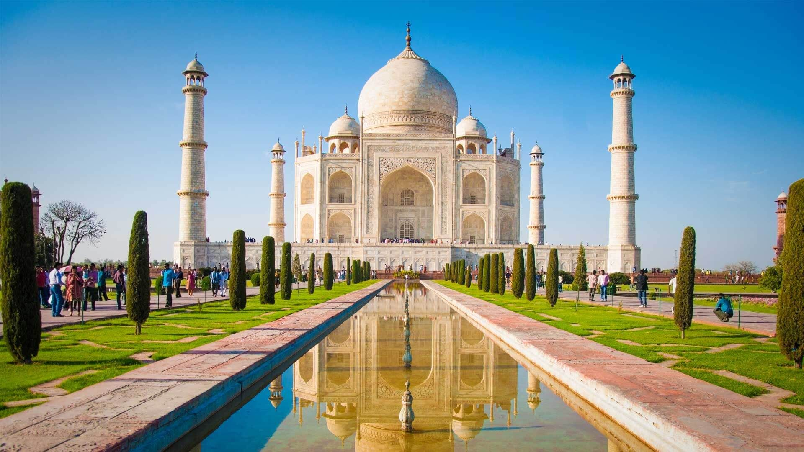

# Tourist-static-website
A clean, responsive tourism website built using **HTML**, **CSS**, and **Bootstrap**.  
It showcases popular travel destinations with beautiful images, carousels, and an embedded YouTube video.

## Overview

This project is a static website for travel enthusiasts who want to explore famous tourist spots around the world.  
It highlights destinations like the **Taj Mahal** and the **Maldives** with engaging visuals.

## Features

- Hero section with background image and call-to-action button  
- Interactive cards displaying travel destinations  
- Bootstrap-powered carousel for image slides  
- Embedded YouTube video for immersive visuals  
- Fully responsive layout  
- Clean and modern design 

##  Technologies Used

- **HTML5**  
- **CSS3**  
- **Bootstrap 4**  

##  Folder Structure

Tourism-Website/
├── assets/
│ ├── hero-bg.jpg
│ ├── maldives-2.jpg
│ ├── maldives.jpg
│ ├── tajmahal-1.jpg
│ └── tajmahal.jpg
├── index.html
├── style.css
└── README.md


---

##  Screenshots

### Home Section


###  Favourite Places


---

## Installation & Usage

1. Clone the repository:
   ```bash
   git clone https://github.com/your-username/Tourism-Website.git

